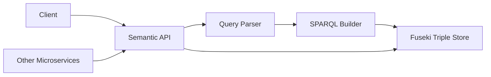

## Introduction

The **Semantic Web Service** (msvc-web-semantica) provides advanced semantic search capabilities for the NOVA.ing medical attention system using RDF (Resource Description Framework) and OWL (Web Ontology Language). It enables natural language queries, reasoning over medical data, and semantic integration across microservices.

## Key Features

<CardGroup cols={2}>
  <Card title="Natural Language Search" icon="magnifying-glass">
    Query medical records using natural language instead of complex database queries
  </Card>
  <Card title="SPARQL Queries" icon="code">
    Execute advanced SPARQL queries for complex data retrieval and reasoning
  </Card>
  <Card title="Real-time Synchronization" icon="arrows-rotate">
    Automatically sync medical appointments, patients, and diagnoses to the RDF triple store
  </Card>
  <Card title="Semantic Reasoning" icon="brain">
    Leverage OWL ontologies to infer relationships and derive insights from medical data
  </Card>
</CardGroup>

## Architecture

The Semantic Web Service is built on:

- **Apache Jena Fuseki**: Triple store database for RDF data
- **SPARQL 1.1**: Query language for semantic data
- **OWL 2**: Ontology language for medical domain modeling
- **Natural Language Parser**: Converts Spanish text queries to SPARQL



## Medical Ontology

The service uses a custom OWL ontology defined at `http://org.nova.atencion.medica/ontologia#` with the following core entities:

### Classes

<ResponseField name="med:Paciente" type="owl:Class">
  Represents a patient in the system
</ResponseField>

<ResponseField name="med:Medico" type="owl:Class">
  Represents a medical doctor
</ResponseField>

<ResponseField name="med:Cita" type="owl:Class">
  Represents a medical appointment
</ResponseField>

<ResponseField name="med:Diagnostico" type="owl:Class">
  Represents a clinical diagnosis
</ResponseField>

### Object Properties (Relationships)

<ResponseField name="med:citaAgendadaPara" type="owl:ObjectProperty">
  Links a Cita to a Paciente (domain: med:Cita, range: med:Paciente)
</ResponseField>

<ResponseField name="med:atendidaPor" type="owl:ObjectProperty">
  Links a Cita to a Medico (domain: med:Cita, range: med:Medico)
</ResponseField>

<ResponseField name="med:generaDiagnostico" type="owl:ObjectProperty">
  Links a Cita to one or more Diagnosticos (domain: med:Cita, range: med:Diagnostico)
</ResponseField>

### Data Properties (Attributes)

**Paciente:**
- `med:dniPaciente` (string)
- `med:nombreCompleto` (string)
- `med:emailPaciente` (string)

**Medico:**
- `med:dniMedico` (string)
- `med:nombreMedico` (string)
- `med:especialidad` (string)

**Cita:**
- `med:fechaCita` (string)
- `med:horaInicio` (string)
- `med:horaFin` (string)
- `med:motivoCita` (string)
- `med:estadoCita` (string)

**Diagnostico:**
- `med:descripcionDiag` (string)
- `med:tipoDiag` (string)

## Fuseki Setup

Before using the Semantic API, you must configure Apache Jena Fuseki:

<Steps>
  <Step title="Navigate to Fuseki directory">
    ```bash
    cd msvc-web-semantica/target/apache-jena-fuseki-6.0.0
    ```
  </Step>
  
  <Step title="Start Fuseki server">
    ```bash
    java -jar fuseki-server.jar
    ```
  </Step>
  
  <Step title="Access web interface">
    Open [http://localhost:3030/](http://localhost:3030/) in your browser
  </Step>
  
  <Step title="Create dataset">
    - Click "New Dataset"
    - **Dataset name**: `atencion_medica`
    - **Dataset type**: Persistent (TDB2) – dataset will persist across Fuseki restarts
  </Step>
  
  <Step title="Upload ontology">
    - Select the file `msvc-web-semantica/src/main/resources/ontology/atencion-medica.ttl`
    - In the Actions column, click "upload now"
  </Step>
</Steps>

<Info>
Fuseki must be running on port 3030 for the Semantic Web Service to function properly.
</Info>

## Base URL

All semantic endpoints are available at:

```
http://localhost:8080/api/v1/semantic
```

## Use Cases

### Natural Language Search Examples

- "citas de cardiología del paciente 12345678"
- "diagnósticos definitivos de Juan Pérez"
- "médicos disponibles en cardiología mañana"
- "ranking top 5 médicos con más citas esta semana"
- "citas canceladas entre 2024-01-01 y 2024-01-31"

### Integration Patterns

1. **Event-driven sync**: Other microservices call `/sync` when appointments are created/updated
2. **Bulk initialization**: Use `/bulk-load` to populate the triple store from existing databases
3. **Advanced queries**: Frontend/backend uses `/buscar` for intelligent search features
4. **Admin/debugging**: Use `/sparql` for direct SPARQL queries

## Next Steps

<CardGroup cols={2}>
  <Card title="API Endpoints" icon="plug" href="/api/semantic/endpoints">
    Explore all available endpoints with request/response examples
  </Card>
  <Card title="SPARQL Queries" icon="terminal" href="/api/semantic/sparql">
    Learn to write custom SPARQL queries for advanced use cases
  </Card>
</CardGroup>
