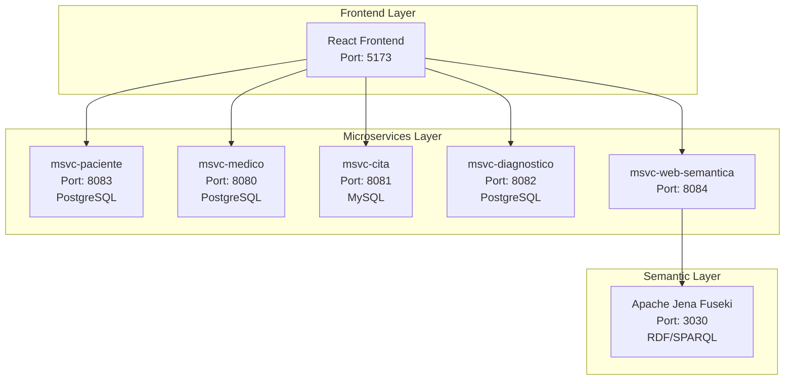
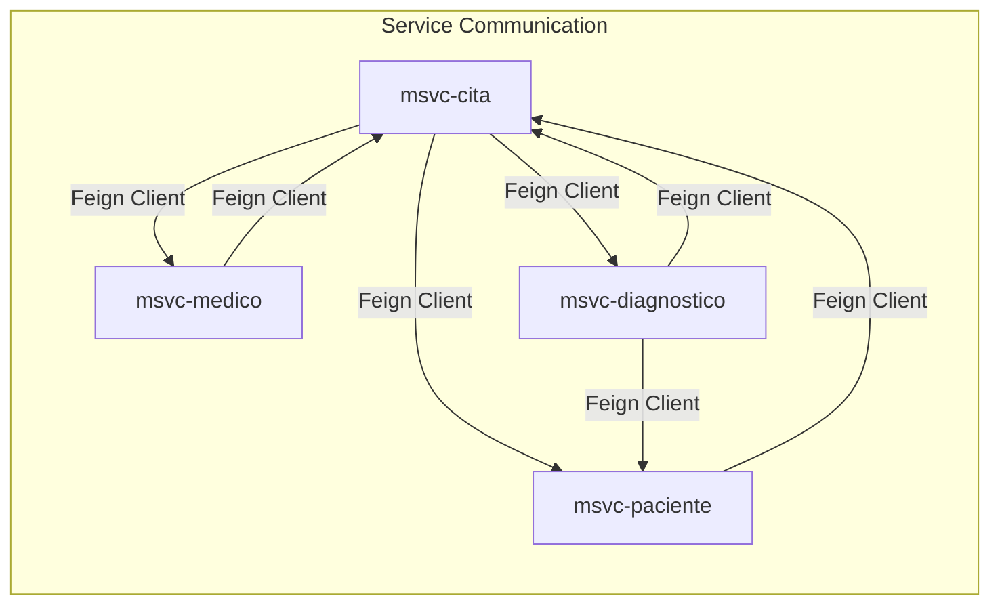
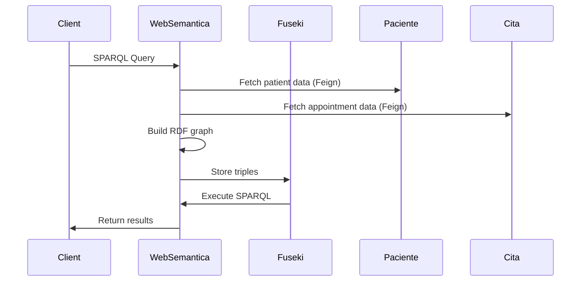

## Overview

NOVA.ing Atención Médica implements a **microservices architecture** for medical care management, integrating services for Patients, Doctors, Appointments, Diagnoses, and Semantic Web capabilities.

<Note>
  This system demonstrates best practices in microservices design, including domain-driven design, service independence, and bidirectional communication patterns.
</Note>

## Technology Stack

<CardGroup cols={3}>
  <Card title="Java 25" icon="coffee">
    Latest Java LTS for microservices
  </Card>
  <Card title="Spring Boot 3.5.9" icon="leaf">
    Modern Spring Boot framework
  </Card>
  <Card title="Spring Cloud 2025.0.1" icon="cloud">
    OpenFeign for inter-service communication
  </Card>
  <Card title="PostgreSQL / MySQL" icon="database">
    Separate databases per service
  </Card>
  <Card title="Apache Jena 5.3.0" icon="brain">
    RDF and SPARQL processing
  </Card>
  <Card title="OWL API" icon="book">
    Ontology management
  </Card>
  <Card title="React + TypeScript" icon="react">
    Modern frontend framework
  </Card>
  <Card title="Vite" icon="bolt">
    Fast build tool and dev server
  </Card>
  <Card title="Lombok" icon="tools">
    Reduced boilerplate code
  </Card>
</CardGroup>

## Microservices Architecture

The system is divided into **5 independent microservices**, each with its own database and clear responsibility:



### Service Descriptions

<AccordionGroup>
  <Accordion title="msvc-paciente (Patient Service)">
    **Port**: 8083  
    **Database**: PostgreSQL  
    **Responsibility**: Manages patient information
    
    **Key Features**:
    - Patient CRUD operations
    - Patient profile management (names, DNI, contact info, address)
    - Medical history retrieval
    - Gender and status tracking
    - Integration with appointment service to show patient history
    
    **Main Endpoints**:
    - `GET /pacientes` - List all patients
    - `GET /pacientes/{id}` - Get patient details
    - `GET /pacientes/{id}/citas` - Get patient appointment history
    - `POST /pacientes` - Create new patient
    - `PUT /pacientes/{id}` - Update patient
    - `DELETE /pacientes/{id}` - Delete patient
    
    **Sample Code** (`/home/daytona/workspace/source/msvc-paciente/src/main/java/org/nova/ing/springcloud/atencion/medica/msvc/paciente/MsvcPacienteApplication.java:19`):
    ```java
    @EnableFeignClients
    @SpringBootApplication
    public class MsvcPacienteApplication {
        public static void main(String[] args) {
            SpringApplication.run(MsvcPacienteApplication.class, args);
        }
    }
    ```
  </Accordion>
  
  <Accordion title="msvc-medico (Doctor Service)">
    **Port**: 8080  
    **Database**: PostgreSQL  
    **Responsibility**: Manages doctor information and specialties
    
    **Key Features**:
    - Doctor CRUD operations
    - Specialty management
    - Availability scheduling
    - Integration with appointment service to show doctor's schedule
    
    **Main Endpoints**:
    - `GET /medicos` - List all doctors
    - `GET /medicos/{id}` - Get doctor details
    - `GET /medicos/{id}/citas` - Get doctor's appointments
    - `GET /medicos/especialidad/{especialidad}` - Find doctors by specialty
    - `POST /medicos` - Create new doctor
    - `PUT /medicos/{id}` - Update doctor
    - `DELETE /medicos/{id}` - Delete doctor
  </Accordion>
  
  <Accordion title="msvc-cita (Appointment Service)">
    **Port**: 8081  
    **Database**: MySQL  
    **Responsibility**: Core operation - manages appointment scheduling and coordinates patient-doctor relationships
    
    **Key Features**:
    - Appointment scheduling and management
    - Date/time conflict detection
    - Links patients with doctors
    - Enriched responses with patient and doctor details via Feign clients
    - Appointment status tracking (scheduled, completed, cancelled)
    
    **Main Endpoints** (`/home/daytona/workspace/source/msvc-cita/src/main/java/org/nova/ing/springcloud/atencion/medica/msvc/cita/controllers/CitaController.java:37`):
    - `GET /citas` - List all appointments
    - `GET /citas/{id}` - Get appointment details
    - `GET /citas/con-detalle/{id}` - Get appointment with enriched patient/doctor/diagnosis data
    - `GET /citas/paciente/{id}` - List appointments by patient
    - `GET /citas/medico/{id}` - List appointments by doctor
    - `POST /citas` - Create new appointment
    - `PUT /citas/{id}` - Update appointment
    - `DELETE /citas/{id}` - Soft delete appointment
    - `DELETE /citas/{id}/force` - Permanently delete appointment
    
    **Sample Controller Code**:
    ```java
    @GetMapping("/con-detalle/{id}")
    public ResponseEntity<?> detalleCompleto(@PathVariable Long id) {
        Optional<CitaDetalle> citaOptional = service.porIdConDetalle(id);
        if (citaOptional.isPresent()) {
            return ResponseEntity.ok(citaOptional.get());
        }
        return ResponseEntity.notFound().build();
    }
    ```
  </Accordion>
  
  <Accordion title="msvc-diagnostico (Diagnosis Service)">
    **Port**: 8082  
    **Database**: PostgreSQL  
    **Responsibility**: Manages medical diagnoses derived from appointments
    
    **Key Features**:
    - Diagnosis CRUD operations
    - Links diagnoses to appointments and patients
    - Treatment plans and prescriptions
    - Medical observations and notes
    - Enriched responses with appointment and patient data
    
    **Main Endpoints**:
    - `GET /diagnosticos` - List all diagnoses
    - `GET /diagnosticos/{id}` - Get diagnosis details
    - `GET /diagnosticos/con-detalle/{id}` - Get diagnosis with appointment and patient data
    - `GET /diagnosticos/paciente/{id}` - Get diagnoses by patient
    - `POST /diagnosticos` - Create new diagnosis
    - `PUT /diagnosticos/{id}` - Update diagnosis
    - `DELETE /diagnosticos/{id}` - Delete diagnosis
  </Accordion>
  
  <Accordion title="msvc-web-semantica (Semantic Web Service)">
    **Port**: 8084  
    **Technology**: Apache Jena, OWL API, Apache Lucene  
    **Responsibility**: Exposes semantic views (RDF/OWL) and SPARQL queries over clinical data
    
    **Key Features**:
    - Builds RDF/OWL graphs from domain microservices
    - JSON-LD export
    - SPARQL query interface
    - Semantic reasoning over medical ontologies
    - Integration with Apache Jena Fuseki for triple store
    
    **Main Endpoints**:
    - `GET /api/v1/semantic/graph` - Get RDF graph
    - `POST /api/v1/semantic/sparql` - Execute SPARQL queries
    - `GET /api/v1/semantic/jsonld` - Export data as JSON-LD
    - `GET /api/v1/semantic/ontology` - Get medical ontology
    
    **Dependencies** (`/home/daytona/workspace/source/msvc-web-semantica/pom.xml:41`):
    ```xml
    <dependency>
        <groupId>org.apache.jena</groupId>
        <artifactId>jena-arq</artifactId>
        <version>5.3.0</version>
    </dependency>
    <dependency>
        <groupId>net.sourceforge.owlapi</groupId>
        <artifactId>owlapi-distribution</artifactId>
        <version>5.1.20</version>
    </dependency>
    ```
  </Accordion>
</AccordionGroup>

## Communication Patterns

### Bidirectional Synchronous Communication with OpenFeign

The system implements **bidirectional synchronous communication** using **Spring Cloud OpenFeign**, maintaining logical referential integrity without coupling databases.

<Tip>
  This pattern allows each service to maintain its own database while still providing rich, aggregated responses to clients.
</Tip>



### Key Communication Relationships

<Tabs>
  <Tab title="Cita → Other Services">
    **msvc-cita** fetches data from other services to enrich appointment details:
    
    - **Cita → Paciente**: Retrieve full patient information (name, contact, medical history)
    - **Cita → Medico**: Retrieve full doctor information (name, specialty, credentials)
    - **Cita → Diagnostico**: Retrieve diagnosis associated with the appointment
    
    This enables the `/citas/con-detalle/{id}` endpoint to return complete appointment information in a single API call.
  </Tab>
  
  <Tab title="Paciente/Medico → Cita">
    **msvc-paciente** and **msvc-medico** query **msvc-cita** to show:
    
    - **Paciente → Cita**: All appointments for a patient (medical history)
    - **Medico → Cita**: All appointments for a doctor (schedule/agenda)
    
    This allows patients and doctors to see their appointment history without storing duplicate data.
  </Tab>
  
  <Tab title="Diagnostico → Cita/Paciente">
    **msvc-diagnostico** fetches data to provide context:
    
    - **Diagnostico → Cita**: Retrieve appointment details for the diagnosis
    - **Diagnostico → Paciente**: Retrieve patient information for the diagnosis
    
    This enables comprehensive diagnosis reports with full context.
  </Tab>
</Tabs>

### Why OpenFeign?

<CardGroup cols={2}>
  <Card title="Declarative" icon="code">
    Clean, declarative syntax compared to RestTemplate or WebClient
  </Card>
  <Card title="Spring Integration" icon="puzzle-piece">
    Seamless integration with Spring Boot ecosystem
  </Card>
  <Card title="Load Balancing" icon="scale-balanced">
    Built-in client-side load balancing
  </Card>
  <Card title="Resilience" icon="shield">
    Easy integration with resilience patterns (Circuit Breaker, Retry)
  </Card>
</CardGroup>

## Data Transfer Objects (DTOs)

To prevent circular dependencies and JPA serialization issues, the system uses **DTOs** for inter-service communication:

```java
// Example: CitaDetalleDTO contains aggregated data
public class CitaDetalle {
    private Long id;
    private Date fechaCita;
    private String motivo;
    private PacienteDTO paciente;  // From msvc-paciente
    private MedicoDTO medico;      // From msvc-medico
    private DiagnosticoDTO diagnostico;  // From msvc-diagnostico
}
```

<Note>
  DTOs decouple the internal domain model from the public API, allowing each service to evolve independently.
</Note>

## Database Independence

Each microservice maintains its own database, following the **Database per Service** pattern:

| Service | Database | Purpose |
|---------|----------|----------|
| msvc-paciente | PostgreSQL | Patient records, personal information |
| msvc-medico | PostgreSQL | Doctor profiles, specialties |
| msvc-cita | MySQL | Appointment scheduling, date/time management |
| msvc-diagnostico | PostgreSQL | Medical diagnoses, treatment plans |
| msvc-web-semantica | N/A | Reads from other services via Feign |

<Warning>
  Never access another service's database directly. Always use REST APIs or Feign clients for inter-service communication.
</Warning>

## Frontend Architecture

The React frontend communicates with microservices through **Vite's proxy configuration**:

**Configuration** (`/home/daytona/workspace/source/nova-frontend/vite.config.ts:31`):
```typescript
server: {
  proxy: {
    '/api/pacientes': {
      target: 'http://localhost:8083',
      changeOrigin: true,
      rewrite: (path) => path.replace(/^\/api\/pacientes/, '/pacientes'),
    },
    '/api/medicos': {
      target: 'http://localhost:8080',
      changeOrigin: true,
      rewrite: (path) => path.replace(/^\/api\/medicos/, '/medicos'),
    },
    '/api/citas': {
      target: 'http://localhost:8081',
      changeOrigin: true,
      rewrite: (path) => path.replace(/^\/api\/citas/, '/citas'),
    },
    '/api/diagnosticos': {
      target: 'http://localhost:8082',
      changeOrigin: true,
      rewrite: (path) => path.replace(/^\/api\/diagnosticos/, '/diagnosticos'),
    },
    '/api/v1/semantic': {
      target: 'http://localhost:8084',
      changeOrigin: true,
    },
  },
}
```

**Frontend Stack**:
- **React 18** - UI library
- **TypeScript** - Type safety
- **Vite** - Build tool and dev server
- **Axios** - HTTP client
- **React Router** - Navigation
- **Zustand** - State management
- **React Hook Form** - Form handling
- **Tailwind CSS** - Styling
- **Lucide React** - Icons

## Semantic Web Layer

The semantic web layer converts relational data to RDF/OWL format:



### Ontology Structure

The system uses a custom medical ontology defined in Turtle format:

```turtle
@prefix am: <http://www.atencionmedica.org/ontology#> .
@prefix rdfs: <http://www.w3.org/2000/01/rdf-schema#> .

am:Paciente a rdfs:Class ;
    rdfs:label "Paciente" ;
    rdfs:comment "Persona que recibe atención médica" .

am:Medico a rdfs:Class ;
    rdfs:label "Médico" ;
    rdfs:comment "Profesional de la salud" .

am:Cita a rdfs:Class ;
    rdfs:label "Cita Médica" ;
    rdfs:comment "Encuentro programado entre paciente y médico" .
```

## Design Decisions & Rationale

<AccordionGroup>
  <Accordion title="Why Feign over RestTemplate?">
    **Feign** was chosen over **RestTemplate** or **WebClient** because:
    
    1. **Declarative syntax** - More readable and maintainable
    2. **Spring Cloud integration** - Seamless with Spring Boot ecosystem
    3. **Less boilerplate** - Reduces code complexity
    4. **Automatic serialization** - Built-in JSON handling
    5. **Better testing** - Easier to mock and test
    
    This follows the pattern observed in the reference project `proyecto-integracion`.
  </Accordion>
  
  <Accordion title="Why DTOs?">
    **Data Transfer Objects (DTOs)** are used to:
    
    1. **Prevent circular dependencies** - Avoid infinite loops in JSON serialization
    2. **Decouple internal models** - Separate domain entities from API contracts
    3. **Reduce coupling** - Services don't need to know each other's internal structure
    4. **API versioning** - Easier to evolve APIs without breaking changes
    5. **Security** - Don't expose internal JPA entities directly
  </Accordion>
  
  <Accordion title="Why Bidirectional Communication?">
    Bidirectional communication patterns enable:
    
    1. **Rich responses** - Cita can show full patient/doctor details
    2. **Medical history** - Patients can see all their appointments
    3. **Doctor schedules** - Doctors can see their appointment calendar
    4. **Diagnosis context** - Diagnoses include appointment and patient info
    
    This provides a better user experience without duplicating data across databases.
  </Accordion>
  
  <Accordion title="Why No Authentication?">
    This is an **academic project** focused on:
    
    - Microservices integration patterns
    - Semantic Web technologies
    - Inter-service communication
    
    Authentication and authorization are intentionally omitted to keep the focus on these core concepts. In production, you would add:
    
    - Spring Security
    - JWT tokens
    - OAuth2/OIDC
    - Role-based access control
  </Accordion>
</AccordionGroup>

## Testing Strategy

The system includes integration tests to verify:

- Spring context loading
- JPA configuration
- Feign client configuration
- Database connectivity (H2 in-memory for tests)

**Run tests for a specific service**:
```bash
./mvnw test -pl msvc-cita
```

Tests use **H2 in-memory database** to isolate the test environment from external dependencies.

## Next Steps

<CardGroup cols={2}>
  <Card title="API Reference" icon="code" href="/api/paciente/overview">
    Explore detailed API documentation for each microservice
  </Card>
  <Card title="Semantic Web Guide" icon="brain" href="/concepts/semantic-web">
    Learn about RDF, OWL, and SPARQL queries
  </Card>
  <Card title="Deployment Setup" icon="rocket" href="/deployment/setup">
    Deploy to production environments
  </Card>
  <Card title="Communication Patterns" icon="arrows-left-right" href="/concepts/communication">
    Learn about inter-service communication
  </Card>
</CardGroup>
