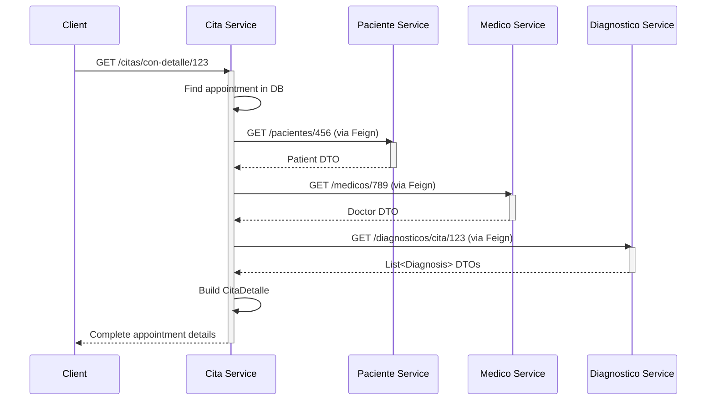

## Communication Strategy

NOVA.ing Atención Médica uses **synchronous HTTP communication** through **Spring Cloud OpenFeign** clients for inter-service communication. This declarative approach simplifies REST client development and integrates seamlessly with Spring Boot.

<Info>
OpenFeign was chosen over RestTemplate or WebClient for its declarative nature, ease of integration, and improved code readability.
</Info>

## OpenFeign Pattern

### What is OpenFeign?

OpenFeign is a declarative HTTP client that makes writing web service clients easier. Instead of manually constructing HTTP requests, you define a Java interface with annotations, and Feign generates the implementation at runtime.

**Key Benefits:**
- **Declarative**: Define clients as interfaces with annotations
- **Integration**: Works seamlessly with Spring Boot and Cloud
- **Load Balancing**: Integrates with Spring Cloud LoadBalancer
- **Circuit Breaking**: Compatible with Resilience4j
- **Readable**: Clean, maintainable code

### Basic Structure

Every Feign client follows this pattern:

```java
@FeignClient(name = "service-name", url = "http://host:port/path")
public interface ServiceClient {
    
    @GetMapping("/resource/{id}")
    ResourceDTO getResource(@PathVariable Long id);
    
    @PostMapping("/resource")
    ResourceDTO createResource(@RequestBody ResourceDTO dto);
}
```

## Real Implementation Examples

### Example 1: Patient Client (msvc-cita)

The appointment service needs to fetch patient details to enrich appointment information.

**File:** `msvc-cita/src/main/java/org/nova/ing/springcloud/atencion/medica/msvc/cita/clients/PacienteClientRest.java`

```java
package org.nova.ing.springcloud.atencion.medica.msvc.cita.clients;

import org.nova.ing.springcloud.atencion.medica.msvc.cita.models.dto.Paciente;
import org.springframework.cloud.openfeign.FeignClient;
import org.springframework.web.bind.annotation.GetMapping;
import org.springframework.web.bind.annotation.PathVariable;

@FeignClient(name = "msvc-paciente", url = "http://localhost:8083/pacientes")
public interface PacienteClientRest {

    @GetMapping("/{id}")
    Paciente detalle(@PathVariable Long id);

    @GetMapping("/usuario/{usuarioId}")
    Paciente detallePorUsuarioId(@PathVariable Long usuarioId);
}
```

<Accordion title="Explanation">
  - **@FeignClient**: Marks this interface as a Feign client
  - **name**: Logical name of the target service (used for service discovery)
  - **url**: Base URL of the target service
  - **@GetMapping**: Maps to HTTP GET requests
  - **@PathVariable**: Injects path parameters into the URL
  - **Return Type**: The DTO that will be deserialized from the JSON response
</Accordion>

### Example 2: Doctor Client (msvc-cita)

**File:** `msvc-cita/src/main/java/org/nova/ing/springcloud/atencion/medica/msvc/cita/clients/MedicoClientRest.java`

```java
package org.nova.ing.springcloud.atencion.medica.msvc.cita.clients;

import org.nova.ing.springcloud.atencion.medica.msvc.cita.models.dto.Medico;
import org.springframework.cloud.openfeign.FeignClient;
import org.springframework.web.bind.annotation.GetMapping;
import org.springframework.web.bind.annotation.PathVariable;

@FeignClient(name = "msvc-medico", url = "http://localhost:8080/medicos")
public interface MedicoClientRest {

    @GetMapping("/{id}")
    Medico detalle(@PathVariable Long id);

    @GetMapping("/usuario/{usuarioId}")
    Medico detallePorUsuarioId(@PathVariable Long usuarioId);
}
```

### Example 3: Diagnosis Client (msvc-cita)

**File:** `msvc-cita/src/main/java/org/nova/ing/springcloud/atencion/medica/msvc/cita/clients/DiagnosticoClientRest.java`

```java
package org.nova.ing.springcloud.atencion.medica.msvc.cita.clients;

import org.nova.ing.springcloud.atencion.medica.msvc.cita.models.dto.Diagnostico;
import org.springframework.cloud.openfeign.FeignClient;
import org.springframework.web.bind.annotation.GetMapping;
import org.springframework.web.bind.annotation.PathVariable;

import java.util.List;

@FeignClient(name = "msvc-diagnostico", url = "http://localhost:8082/diagnosticos")
public interface DiagnosticoClientRest {

    @GetMapping("/cita/{id}")
    List<Diagnostico> listarPorCita(@PathVariable Long id);
}
```

<Note>
This client returns a **List** of diagnoses since one appointment can have multiple diagnoses.
</Note>

### Example 4: Appointment Client (msvc-paciente)

The patient service calls back to the appointment service to retrieve appointment history.

**File:** `msvc-paciente/src/main/java/org/nova/ing/springcloud/atencion/medica/msvc/paciente/clients/CitaClientRest.java`

```java
package org.nova.ing.springcloud.atencion.medica.msvc.paciente.clients;

import org.nova.ing.springcloud.atencion.medica.msvc.paciente.models.dto.Cita;
import org.springframework.cloud.openfeign.FeignClient;
import org.springframework.web.bind.annotation.*;

import java.util.List;

@FeignClient(name = "msvc-cita", url = "http://localhost:8081/citas")
public interface CitaClientRest {

    @GetMapping("/paciente/{id}")
    List<Cita> listarPorPaciente(@PathVariable Long id);

    @PostMapping
    Cita crear(@RequestBody Cita cita);

    @GetMapping("/{id}")
    Cita obtenerPorId(@PathVariable Long id);

    @PutMapping("/{id}")
    Cita actualizar(@PathVariable Long id, @RequestBody Cita cita);
}
```

<Accordion title="Advanced Features">
  This client demonstrates:
  - **GET with path parameter**: Retrieve appointments by patient ID
  - **POST with body**: Create new appointments
  - **PUT with path parameter and body**: Update existing appointments
  - **Multiple operations**: Full CRUD capabilities through Feign
</Accordion>

## Using Feign Clients in Services

Here's how Feign clients are used in a service implementation:

**File:** `msvc-cita/src/main/java/org/nova/ing/springcloud/atencion/medica/msvc/cita/services/implementation/CitaServiceImpl.java`

```java
@Slf4j
@Service
public class CitaServiceImpl implements CitaService {

    @Autowired
    private CitaRepository repository;

    @Autowired
    private PacienteClientRest pacienteClient;

    @Autowired
    private MedicoClientRest medicoClient;

    @Autowired
    private DiagnosticoClientRest diagnosticoClient;

    @Autowired
    private SemanticClientRest semanticClient;

    @Override
    @Transactional(readOnly = true)
    public Optional<CitaDetalle> porIdConDetalle(Long id) {
        Optional<CitaEntity> o = repository.findById(id);
        if (o.isPresent()) {
            CitaEntity cita = o.get();
            CitaDetalle detalle = new CitaDetalle();
            detalle.setCita(cita);
            
            try {
                // Call msvc-paciente to get patient details
                detalle.setPaciente(pacienteClient.detalle(cita.getPacienteId()));
                
                // Call msvc-medico to get doctor details
                detalle.setMedico(medicoClient.detalle(cita.getMedicoId()));
                
                // Call msvc-diagnostico to get diagnoses
                detalle.setDiagnosticos(diagnosticoClient.listarPorCita(cita.getId()));
            } catch (Exception e) {
                log.error("Error al obtener detalles externos: {}", e.getMessage());
            }
            return Optional.of(detalle);
        }
        return Optional.empty();
    }
}
```

<Accordion title="How it works">
  1. **Dependency Injection**: Feign clients are injected like any Spring bean
  2. **Method Call**: Simply call the interface method - Feign handles the HTTP request
  3. **Automatic Serialization**: Request/response bodies are automatically converted to/from JSON
  4. **Error Handling**: Wrap calls in try-catch to handle remote service failures gracefully
  5. **Transaction Management**: Use `@Transactional(readOnly = true)` for read operations
</Accordion>

## Communication Flow Example

Let's trace a request through the system:



<Info>
This is a **synchronous orchestration pattern** where the Cita service acts as the orchestrator, calling multiple services sequentially.
</Info>

## Configuration

To enable Feign in your Spring Boot application:

### 1. Add Dependencies

```xml
<dependency>
    <groupId>org.springframework.cloud</groupId>
    <artifactId>spring-cloud-starter-openfeign</artifactId>
</dependency>
```

### 2. Enable Feign Clients

Add `@EnableFeignClients` to your main application class:

```java
@SpringBootApplication
@EnableFeignClients
public class MsvcCitaApplication {
    public static void main(String[] args) {
        SpringApplication.run(MsvcCitaApplication.class, args);
    }
}
```

### 3. Configure Timeouts (Optional)

```yaml
feign:
  client:
    config:
      default:
        connectTimeout: 5000
        readTimeout: 5000
```

## Error Handling

<Tabs>
  <Tab title="Basic Try-Catch">
    ```java
    try {
        Paciente paciente = pacienteClient.detalle(id);
        return paciente;
    } catch (FeignException.NotFound e) {
        log.error("Patient not found: {}", id);
        return null;
    } catch (FeignException e) {
        log.error("Error calling patient service: {}", e.getMessage());
        throw new ServiceCommunicationException("Failed to fetch patient data");
    }
    ```
  </Tab>
  
  <Tab title="Custom Error Decoder">
    ```java
    @Configuration
    public class FeignConfig {
        @Bean
        public ErrorDecoder errorDecoder() {
            return new CustomErrorDecoder();
        }
    }

    public class CustomErrorDecoder implements ErrorDecoder {
        @Override
        public Exception decode(String methodKey, Response response) {
            switch (response.status()) {
                case 404:
                    return new NotFoundException("Resource not found");
                case 503:
                    return new ServiceUnavailableException("Service temporarily unavailable");
                default:
                    return new FeignException.FeignServerException(
                        response.status(), 
                        "Error calling remote service", 
                        response.request(), 
                        null, 
                        null
                    );
            }
        }
    }
    ```
  </Tab>
  
  <Tab title="Fallback Methods">
    ```java
    @FeignClient(
        name = "msvc-paciente",
        url = "http://localhost:8083/pacientes",
        fallback = PacienteClientFallback.class
    )
    public interface PacienteClientRest {
        @GetMapping("/{id}")
        Paciente detalle(@PathVariable Long id);
    }

    @Component
    public class PacienteClientFallback implements PacienteClientRest {
        @Override
        public Paciente detalle(Long id) {
            log.warn("Fallback: Returning empty patient for id {}", id);
            return new Paciente(); // Return safe default
        }
    }
    ```
  </Tab>
</Tabs>

## Best Practices

<AccordionGroup>
  <Accordion title="1. Use DTOs, Not Entities">
    Never pass JPA entities between services. Always create dedicated DTOs:
    
    ```java
    // Good
    public class PacienteDTO {
        private Long id;
        private String nombres;
        private String apellidos;
        private String dni;
    }
    
    // Bad - Don't do this
    @Entity
    public class PacienteEntity {
        @Id
        private Long id;
        @OneToMany
        private List<CitaEntity> citas; // Circular dependency!
    }
    ```
  </Accordion>

  <Accordion title="2. Handle Timeouts Gracefully">
    Always wrap Feign calls in try-catch blocks and provide meaningful fallbacks:
    
    ```java
    try {
        return medicoClient.detalle(id);
    } catch (Exception e) {
        log.error("Service timeout: {}", e.getMessage());
        return getMedicoFromCache(id); // Fallback to cache
    }
    ```
  </Accordion>

  <Accordion title="3. Implement Circuit Breakers">
    For production systems, add Resilience4j circuit breakers:
    
    ```xml
    <dependency>
        <groupId>io.github.resilience4j</groupId>
        <artifactId>resilience4j-spring-boot2</artifactId>
    </dependency>
    ```
    
    ```java
    @CircuitBreaker(name = "pacienteService", fallbackMethod = "fallbackGetPaciente")
    public Paciente getPaciente(Long id) {
        return pacienteClient.detalle(id);
    }
    ```
  </Accordion>

  <Accordion title="4. Use Logging for Debugging">
    Enable Feign request/response logging:
    
    ```yaml
    logging:
      level:
        org.nova.ing.springcloud.atencion.medica.msvc.cita.clients: DEBUG
    
    feign:
      client:
        config:
          default:
            loggerLevel: FULL
    ```
  </Accordion>

  <Accordion title="5. Consider Async Operations">
    For non-critical operations, consider using `@Async` or reactive approaches:
    
    ```java
    @Async
    public CompletableFuture<Paciente> getPacienteAsync(Long id) {
        return CompletableFuture.completedFuture(
            pacienteClient.detalle(id)
        );
    }
    ```
  </Accordion>
</AccordionGroup>

## Service Dependency Map

<Note>
Understanding dependencies helps identify potential bottlenecks and single points of failure.
</Note>

| Service | Depends On | Called By |
|---------|------------|----------|
| **msvc-paciente** | msvc-cita | msvc-cita, msvc-diagnostico, msvc-web-semantica |
| **msvc-medico** | msvc-cita | msvc-cita, msvc-web-semantica |
| **msvc-cita** | msvc-paciente, msvc-medico, msvc-diagnostico, msvc-web-semantica | msvc-paciente, msvc-medico, msvc-diagnostico, msvc-web-semantica |
| **msvc-diagnostico** | msvc-cita, msvc-paciente, msvc-web-semantica | msvc-cita, msvc-web-semantica |
| **msvc-web-semantica** | msvc-paciente, msvc-medico, msvc-cita, msvc-diagnostico | msvc-cita, msvc-diagnostico |

<Warning>
**msvc-cita** is the most connected service and represents a potential bottleneck. Consider:
- Implementing robust error handling
- Adding caching layers
- Monitoring performance closely
- Implementing rate limiting
</Warning>

## Testing Feign Clients

```java
@SpringBootTest
class PacienteClientRestTest {

    @Autowired
    private PacienteClientRest pacienteClient;

    @Test
    void testGetPacienteDetails() {
        // Assuming patient with ID 1 exists
        Paciente paciente = pacienteClient.detalle(1L);
        
        assertNotNull(paciente);
        assertNotNull(paciente.getId());
        assertNotNull(paciente.getNombres());
    }
}
```

## Next Steps

<CardGroup cols={2}>
  <Card title="Microservices Overview" icon="sitemap" href="/concepts/microservices">
    Understand the overall architecture
  </Card>
  <Card title="Semantic Web Integration" icon="brain" href="/concepts/semantic-web">
    Learn about RDF, OWL, and SPARQL
  </Card>
</CardGroup>