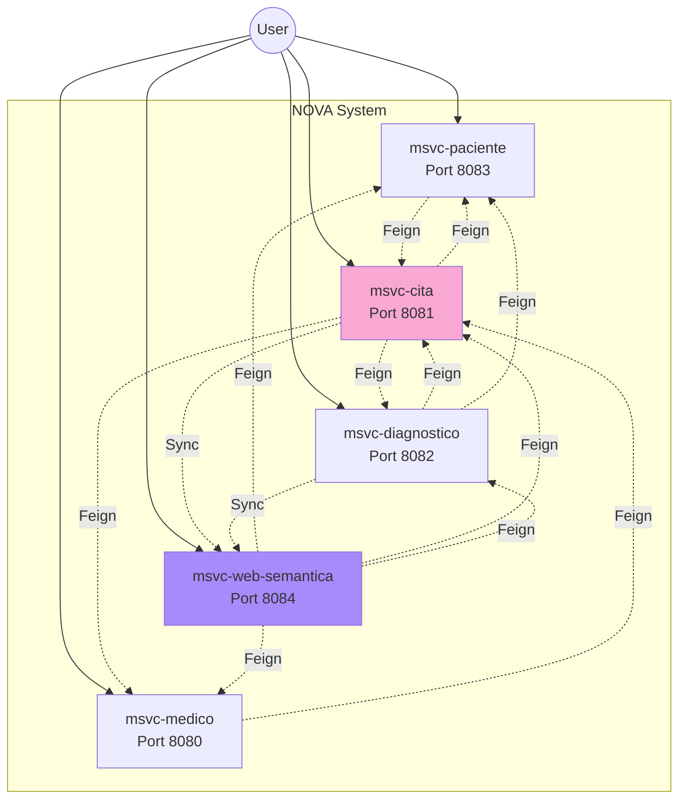

## Overview

NOVA.ing Atención Médica implements a **distributed microservices architecture** where each service manages its own domain and database, following the principles of Domain-Driven Design (DDD) and the Single Responsibility Principle.

<Info>
The system consists of 5 independent microservices that communicate through synchronous REST APIs using Spring Cloud OpenFeign.
</Info>

## Architecture Diagram



## Service Domains

<Accordion title="msvc-paciente (Patient Service)">
  **Port:** 8083  
  **Database:** Independent PostgreSQL/MySQL  
  **Responsibility:** Manages patient information including demographics, contact details, and medical history.

  **Key Endpoints:**
  - `GET /pacientes` - List all patients
  - `GET /pacientes/{id}` - Get patient details
  - `GET /pacientes/{id}/citas` - Get patient with appointment history (calls msvc-cita)
  - `POST /pacientes` - Create new patient
  - `PUT /pacientes/{id}` - Update patient information

  **Dependencies:**
  - Calls `msvc-cita` to enrich patient data with appointment history
</Accordion>

<Accordion title="msvc-medico (Doctor Service)">
  **Port:** 8080  
  **Database:** Independent PostgreSQL/MySQL  
  **Responsibility:** Manages doctor information including specialties, credentials, and availability.

  **Key Endpoints:**
  - `GET /medicos` - List all doctors
  - `GET /medicos/{id}` - Get doctor details
  - `GET /medicos/{id}/citas` - Get doctor with scheduled appointments
  - `GET /medicos/especialidad/{especialidad}` - Find doctors by specialty
  - `POST /medicos` - Register new doctor

  **Dependencies:**
  - Calls `msvc-cita` to retrieve appointment schedule
</Accordion>

<Accordion title="msvc-cita (Appointment Service)">
  **Port:** 8081  
  **Database:** Independent PostgreSQL/MySQL  
  **Responsibility:** Core operation hub - manages appointment scheduling and coordinates relationships between patients and doctors.

  **Key Endpoints:**
  - `GET /citas/con-detalle/{id}` - Get appointment with full details (enriched)
  - `GET /citas/paciente/{id}` - List appointments by patient
  - `GET /citas/medico/{id}` - List appointments by doctor
  - `POST /citas` - Create new appointment
  - `PUT /citas/{id}` - Update appointment
  - `DELETE /citas/{id}` - Cancel appointment

  **Dependencies:**
  - Calls `msvc-paciente` to fetch patient details
  - Calls `msvc-medico` to fetch doctor details
  - Calls `msvc-diagnostico` to retrieve associated diagnoses
  - Calls `msvc-web-semantica` to synchronize appointment data

  <Note>
  This is the most connected service, acting as the orchestration hub for medical appointments.
  </Note>
</Accordion>

<Accordion title="msvc-diagnostico (Diagnosis Service)">
  **Port:** 8082  
  **Database:** Independent PostgreSQL/MySQL  
  **Responsibility:** Manages medical diagnoses and results derived from appointments.

  **Key Endpoints:**
  - `GET /diagnosticos` - List all diagnoses
  - `GET /diagnosticos/{id}` - Get diagnosis details
  - `GET /diagnosticos/con-detalle/{id}` - Get diagnosis with appointment and patient info
  - `GET /diagnosticos/cita/{id}` - Get diagnoses for a specific appointment
  - `POST /diagnosticos` - Create new diagnosis

  **Dependencies:**
  - Calls `msvc-cita` to retrieve appointment information
  - Calls `msvc-paciente` to get patient context
  - Calls `msvc-web-semantica` to synchronize diagnosis data
</Accordion>

<Accordion title="msvc-web-semantica (Semantic Web Service)">
  **Port:** 8084  
  **Storage:** Apache Jena Fuseki (RDF Triple Store)  
  **Responsibility:** Exposes semantic views (RDF/OWL) and SPARQL query capabilities over clinical data.

  **Key Endpoints:**
  - `GET /api/v1/semantic/buscar?texto=...` - Natural language search
  - `POST /api/v1/semantic/sync` - Synchronize data from other services
  - `POST /api/v1/semantic/sparql` - Execute SPARQL queries
  - `POST /api/v1/semantic/bulk-load` - Load all data into semantic graph

  **Dependencies:**
  - Calls ALL domain services to fetch and synchronize data
  - Maintains RDF knowledge graph for semantic querying

  <Info>
  This service demonstrates Web Semantics integration, enabling advanced querying and knowledge representation.
  </Info>
</Accordion>

## Design Decisions

### 1. Database per Service

Each microservice has its own database, ensuring:
- **Loose coupling** - Services can evolve independently
- **Technology flexibility** - Each service can choose its own database technology
- **Fault isolation** - Database failures don't cascade across services
- **Scalability** - Services can be scaled independently based on load

### 2. Synchronous Communication

The system uses **synchronous REST calls** via OpenFeign for inter-service communication:

**Advantages:**
- Simple to implement and debug
- Immediate consistency for read operations
- Built-in Spring Boot integration
- Academic clarity for learning microservices patterns

**Trade-offs:**
- Services are coupled at runtime (if one service is down, dependent operations fail)
- Potential for cascading failures
- Higher latency for chained calls

<Note>
For production systems, consider implementing:
- Circuit breakers (Resilience4j)
- Retry policies with exponential backoff
- Fallback mechanisms
- Asynchronous messaging (RabbitMQ, Kafka) for non-critical operations
</Note>

### 3. DTO Pattern

The system uses **Data Transfer Objects (DTOs)** rather than exposing JPA entities directly:

```java
// Example from msvc-cita
public class CitaDetalle {
    private CitaEntity cita;
    private Paciente paciente;      // DTO from msvc-paciente
    private Medico medico;          // DTO from msvc-medico
    private List<Diagnostico> diagnosticos; // DTOs from msvc-diagnostico
}
```

**Benefits:**
- Prevents circular dependencies in JSON serialization
- Decouples internal domain model from API contract
- Allows tailoring responses to specific use cases
- Improves security by not exposing internal entity structure

### 4. Bidirectional Relationships

Services maintain bidirectional logical relationships through Feign clients:

- **Cita → Paciente/Medico**: Appointments need to show complete patient and doctor details
- **Paciente/Medico → Cita**: Patients and doctors need to access their appointment history
- **Diagnostico → Cita/Paciente**: Diagnoses are intrinsically linked to appointments and patients

<Warning>
Bidirectional relationships require careful handling to avoid:
- Circular dependency loops
- N+1 query problems
- Cascading failures

Always use DTOs and consider implementing caching strategies.
</Warning>

## Technology Stack

<Tabs>
  <Tab title="Core Framework">
    - **Java 25** - Latest LTS version
    - **Spring Boot 3.5.9** - Application framework
    - **Spring Cloud 2025.0.1** - Microservices infrastructure
    - **Lombok** - Reduces boilerplate code
  </Tab>
  
  <Tab title="Communication">
    - **Spring Cloud OpenFeign** - Declarative REST clients
    - **Spring Web** - REST API endpoints
    - **Jackson** - JSON serialization
  </Tab>
  
  <Tab title="Data Persistence">
    - **Spring Data JPA** - Data access layer
    - **Hibernate** - ORM implementation
    - **PostgreSQL/MySQL** - Relational databases
    - **H2** - In-memory database for testing
  </Tab>
  
  <Tab title="Semantic Web">
    - **Apache Jena 5.3.0** - RDF framework
    - **OWL API 5.1.20** - Ontology management
    - **Apache Jena Fuseki** - SPARQL endpoint server
  </Tab>
</Tabs>

## Running the System

To start all microservices:

```bash
# Terminal 1 - Patient Service
cd msvc-paciente && ./mvnw spring-boot:run

# Terminal 2 - Doctor Service  
cd msvc-medico && ./mvnw spring-boot:run

# Terminal 3 - Appointment Service
cd msvc-cita && ./mvnw spring-boot:run

# Terminal 4 - Diagnosis Service
cd msvc-diagnostico && ./mvnw spring-boot:run

# Terminal 5 - Semantic Web Service
cd msvc-web-semantica && ./mvnw spring-boot:run
```

<Info>
**Note:** This implementation does not include authentication or authorization - all endpoints are open for academic purposes to focus on microservices and semantic web integration.
</Info>

## Service Health Checks

Verify each service is running:

```bash
curl http://localhost:8083/pacientes
curl http://localhost:8080/medicos
curl http://localhost:8081/citas
curl http://localhost:8082/diagnosticos
curl http://localhost:8084/api/v1/semantic/buscar?texto=test
```

## Next Steps

<CardGroup cols={2}>
  <Card title="Communication Patterns" icon="arrows-left-right" href="/concepts/communication">
    Learn how services communicate using OpenFeign
  </Card>
  <Card title="Semantic Web" icon="brain" href="/concepts/semantic-web">
    Explore RDF, OWL, and SPARQL integration
  </Card>
</CardGroup>