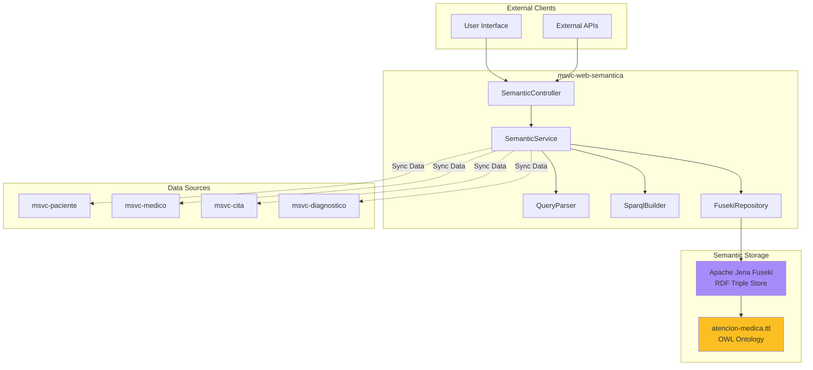
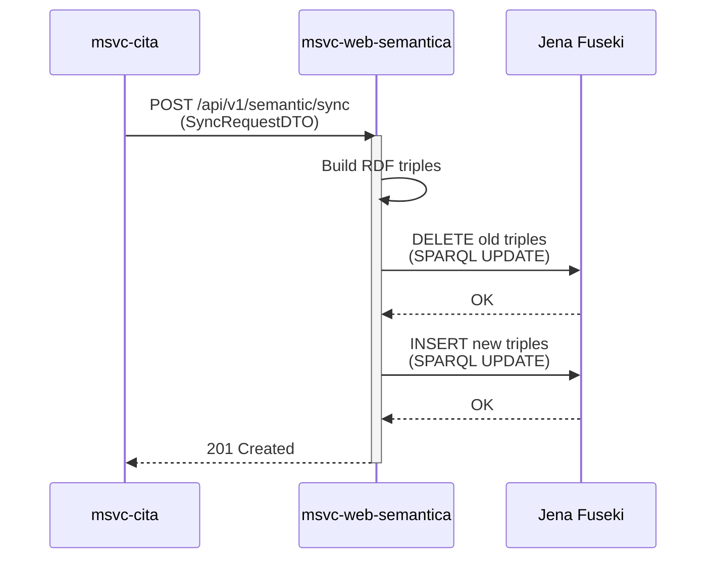

## Overview

NOVA.ing Atención Médica integrates **Semantic Web technologies** to provide advanced querying capabilities, knowledge representation, and intelligent data inference over medical data. This is achieved through the `msvc-web-semantica` microservice.

<Info>
The semantic layer enables natural language searches, relationship discovery, and complex queries that would be difficult or impossible with traditional SQL.
</Info>

## What is the Semantic Web?

The Semantic Web is an extension of the World Wide Web that enables data to be shared and reused across application boundaries. It uses standards like:

- **RDF (Resource Description Framework)**: A standard model for data interchange
- **OWL (Web Ontology Language)**: Defines relationships and rules
- **SPARQL**: Query language for RDF data
- **Turtle/TTL**: Human-readable RDF serialization format

<Accordion title="Why Semantic Web for Healthcare?">
  Medical data is inherently complex with many relationships:
  - Patients have multiple appointments
  - Doctors have specialties and treat multiple patients
  - Diagnoses relate to appointments and patients
  - Medical knowledge includes hierarchies (diseases, treatments, specialties)
  
  Semantic Web technologies excel at:
  - **Representing complex relationships** between entities
  - **Inference**: Deriving new knowledge from existing data
  - **Integration**: Combining data from multiple sources
  - **Flexible querying**: Finding patterns and relationships
  - **Interoperability**: Standards-based data exchange
</Accordion>

## Architecture



## Technology Stack

### Dependencies

**File:** `msvc-web-semantica/pom.xml`

```xml
<!-- Apache Jena for RDF and SPARQL -->
<dependency>
    <groupId>org.apache.jena</groupId>
    <artifactId>jena-arq</artifactId>
    <version>5.3.0</version>
</dependency>
<dependency>
    <groupId>org.apache.jena</groupId>
    <artifactId>jena-core</artifactId>
    <version>5.3.0</version>
</dependency>

<!-- OWL API for Ontology Management -->
<dependency>
    <groupId>net.sourceforge.owlapi</groupId>
    <artifactId>owlapi-distribution</artifactId>
    <version>5.1.20</version>
</dependency>

<!-- Spring Cloud OpenFeign for service communication -->
<dependency>
    <groupId>org.springframework.cloud</groupId>
    <artifactId>spring-cloud-starter-openfeign</artifactId>
</dependency>
```

<Tabs>
  <Tab title="Apache Jena">
    **Apache Jena** is a Java framework for building Semantic Web applications.
    
    **Features:**
    - RDF data model implementation
    - SPARQL query engine
    - OWL ontology support
    - Triple store integration
    - Inference engines (RDFS, OWL)
    
    **In NOVA.ing:**
    - Manages RDF triples for medical data
    - Executes SPARQL queries
    - Provides reasoning capabilities
  </Tab>
  
  <Tab title="OWL API">
    **OWL API** provides tools for working with OWL ontologies.
    
    **Features:**
    - Load and save ontologies
    - Manipulate ontology structure
    - Run reasoners
    - Validate ontologies
    
    **In NOVA.ing:**
    - Loads the medical attention ontology
    - Defines domain classes and properties
    - Enables semantic validation
  </Tab>
  
  <Tab title="Apache Jena Fuseki">
    **Fuseki** is a SPARQL server that provides HTTP access to RDF data.
    
    **Features:**
    - RESTful SPARQL endpoint
    - Dataset management
    - Update operations
    - Web UI for testing queries
    
    **In NOVA.ing:**
    - Stores the medical knowledge graph
    - Exposes SPARQL query endpoint
    - Handles data synchronization
  </Tab>
</Tabs>

## The Medical Attention Ontology

### Ontology Definition

**File:** `msvc-web-semantica/src/main/resources/ontology/atencion-medica.ttl`

```turtle
@prefix med:  <http://org.nova.atencion.medica/ontologia#> .
@prefix owl:  <http://www.w3.org/2002/07/owl#> .
@prefix rdf:  <http://www.w3.org/1999/02/22-rdf-syntax-ns#> .
@prefix rdfs: <http://www.w3.org/2000/01/rdf-schema#> .
@prefix xsd:  <http://www.w3.org/2001/XMLSchema#> .

<http://org.nova.atencion.medica/ontologia#> a owl:Ontology ;
    rdfs:label "Ontología de Gestión de Atención Médica" .

# ==========================================
# CLASSES (Domain Entities)
# ==========================================

med:Paciente a owl:Class ; rdfs:label "Paciente" .
med:Medico a owl:Class ; rdfs:label "Médico" .
med:Cita a owl:Class ; rdfs:label "Cita Médica" .
med:Diagnostico a owl:Class ; rdfs:label "Diagnóstico Clínico" .

# ==========================================
# DATA PROPERTIES (Attributes)
# ==========================================

# --- Paciente ---
med:dniPaciente a owl:DatatypeProperty ; 
    rdfs:domain med:Paciente ; 
    rdfs:range xsd:string .
med:nombreCompleto a owl:DatatypeProperty ; 
    rdfs:domain med:Paciente ; 
    rdfs:range xsd:string .
med:emailPaciente a owl:DatatypeProperty ; 
    rdfs:domain med:Paciente ; 
    rdfs:range xsd:string .

# --- Médico ---
med:dniMedico a owl:DatatypeProperty ; 
    rdfs:domain med:Medico ; 
    rdfs:range xsd:string .
med:nombreMedico a owl:DatatypeProperty ; 
    rdfs:domain med:Medico ; 
    rdfs:range xsd:string .
med:especialidad a owl:DatatypeProperty ; 
    rdfs:domain med:Medico ; 
    rdfs:range xsd:string .

# --- Cita ---
med:fechaCita a owl:DatatypeProperty ; 
    rdfs:domain med:Cita ; 
    rdfs:range xsd:string .
med:motivoCita a owl:DatatypeProperty ; 
    rdfs:domain med:Cita ; 
    rdfs:range xsd:string .
med:estadoCita a owl:DatatypeProperty ; 
    rdfs:domain med:Cita ; 
    rdfs:range xsd:string .

# --- Diagnóstico ---
med:descripcionDiag a owl:DatatypeProperty ; 
    rdfs:domain med:Diagnostico ; 
    rdfs:range xsd:string .
med:tipoDiag a owl:DatatypeProperty ; 
    rdfs:domain med:Diagnostico ; 
    rdfs:range xsd:string .

# ==========================================
# OBJECT PROPERTIES (Relationships)
# ==========================================

# An appointment belongs to a patient
med:citaAgendadaPara a owl:ObjectProperty ;
    rdfs:domain med:Cita ;
    rdfs:range med:Paciente .

# An appointment is attended by a doctor
med:atendidaPor a owl:ObjectProperty ;
    rdfs:domain med:Cita ;
    rdfs:range med:Medico .

# An appointment generates one or more diagnoses
med:generaDiagnostico a owl:ObjectProperty ;
    rdfs:domain med:Cita ;
    rdfs:range med:Diagnostico .
```

<Accordion title="Understanding the Ontology Structure">
  **Classes** represent the main entities:
  - `med:Paciente` - Patient
  - `med:Medico` - Doctor
  - `med:Cita` - Medical Appointment
  - `med:Diagnostico` - Diagnosis

  **Data Properties** are literal attributes:
  - Strings: names, DNI/ID numbers, emails
  - Dates: appointment dates
  - Enums: appointment status, diagnosis type

  **Object Properties** define relationships:
  - `citaAgendadaPara`: Links Cita → Paciente
  - `atendidaPor`: Links Cita → Medico
  - `generaDiagnostico`: Links Cita → Diagnostico

  This structure allows for:
  - **Graph traversal**: Follow relationships in any direction
  - **Inference**: Derive facts (e.g., "all patients of a doctor")
  - **Validation**: Ensure data integrity according to ontology rules
</Accordion>

## Data Synchronization

The semantic service synchronizes data from the relational microservices into the RDF knowledge graph.

### Synchronization Flow



### Sync Implementation

**File:** `msvc-web-semantica/src/main/java/org/springcloud/nova/ing/atencion/medica/msvc/web/semantica/services/SemanticServiceImpl.java`

```java
@Override
public void sincronizarAtencionMedica(SyncRequestDTO dto) {
    log.info("Sincronizando Cita ID: {} en el Grafo Semántico", dto.getCitaId());

    String citaUri    = "med:Cita_" + dto.getCitaId();
    String pacienteUri = "med:Paciente_" + dto.getPacienteId();
    String medicoUri   = "med:Medico_" + dto.getMedicoId();

    // 1. DELETE previous triples
    StringBuilder delete = new StringBuilder();
    delete.append("PREFIX med: <").append(MED.NS).append(">\n");
    delete.append("DELETE WHERE { ").append(citaUri).append(" ?p ?o } ;\n");
    delete.append("DELETE WHERE { ").append(pacienteUri).append(" ?p ?o } ;\n");
    delete.append("DELETE WHERE { ").append(medicoUri).append(" ?p ?o }");

    fusekiRepository.executeUpdate(delete.toString());

    // 2. INSERT fresh data
    StringBuilder insert = new StringBuilder();
    insert.append("PREFIX med: <").append(MED.NS).append(">\n");
    insert.append("PREFIX rdf: <http://www.w3.org/1999/02/22-rdf-syntax-ns#>\n");
    insert.append("INSERT DATA {\n");

    // Appointment triples
    insert.append(String.format("  %s rdf:type med:Cita ;\n", citaUri));
    insert.append(String.format("    med:fechaCita \"%s\" ;\n", dto.getFechaCita()));
    insert.append(String.format("    med:motivoCita \"%s\" ;\n", dto.getMotivo()));
    insert.append(String.format("    med:estadoCita \"%s\" ;\n", dto.getEstadoCita()));
    insert.append(String.format("    med:citaAgendadaPara %s ;\n", pacienteUri));
    insert.append(String.format("    med:atendidaPor %s .\n", medicoUri));

    // Patient triples
    insert.append(String.format("  %s rdf:type med:Paciente ;\n", pacienteUri));
    insert.append(String.format("    med:dniPaciente \"%s\" ;\n", dto.getDniPaciente()));
    insert.append(String.format("    med:nombreCompleto \"%s %s\" .\n", 
        dto.getNombrePaciente(), dto.getApellidoPaciente()));

    // Doctor triples
    insert.append(String.format("  %s rdf:type med:Medico ;\n", medicoUri));
    insert.append(String.format("    med:dniMedico \"%s\" ;\n", dto.getDniMedico()));
    insert.append(String.format("    med:nombreMedico \"%s\" ;\n", dto.getNombreMedico()));
    insert.append(String.format("    med:especialidad \"%s\" .\n", dto.getEspecialidad()));

    insert.append("}");

    fusekiRepository.executeUpdate(insert.toString());
    log.info("Cita {} sincronizada exitosamente.", dto.getCitaId());
}
```

<Note>
This method demonstrates **upsert** semantics: delete old triples, then insert fresh data. This ensures the graph stays synchronized with the source databases.
</Note>

### Bulk Data Loading

For initial data population or full synchronization:

**File:** `msvc-web-semantica/src/main/java/org/springcloud/nova/ing/atencion/medica/msvc/web/semantica/services/BulkSyncService.java`

```java
public void sincronizarTodoElSistema() {
    log.info("### INICIANDO CARGA MASIVA AL GRAFO SEMÁNTICO ###");

    try {
        // 0. Clear existing graph
        log.info("Limpiando grafo existente...");
        fusekiRepository.executeUpdate("CLEAR DEFAULT");

        // 1. Load all patients
        Map<Long, PacienteLoadDTO> pacientesMap = 
            pacienteClient.listarTodos().stream()
                .collect(Collectors.toMap(PacienteLoadDTO::getId, p -> p));

        // 2. Load all doctors
        Map<Long, MedicoLoadDTO> medicosMap = 
            medicoClient.listarTodos().stream()
                .collect(Collectors.toMap(MedicoLoadDTO::getId, m -> m));

        // 3. Process all appointments
        List<CitaLoadDTO> citas = citaClient.listarTodas();
        for (CitaLoadDTO c : citas) {
            PacienteLoadDTO paciente = pacientesMap.get(c.getPacienteId());
            MedicoLoadDTO medico = medicosMap.get(c.getMedicoId());

            if (paciente != null && medico != null) {
                SyncRequestDTO dto = SyncRequestDTO.builder()
                    .citaId(c.getId())
                    .fechaCita(c.getFechaCita())
                    .pacienteId(paciente.getId())
                    .dniPaciente(paciente.getDni())
                    .nombrePaciente(paciente.getNombres())
                    .medicoId(medico.getId())
                    .dniMedico(medico.getDni())
                    .especialidad(medico.getEspecialidad())
                    .build();

                semanticService.sincronizarAtencionMedica(dto);
            }
        }

        // 4. Process all diagnoses
        List<DiagnosticoLoadDTO> diagnosticos = diagnosticoClient.listarTodos();
        for (DiagnosticoLoadDTO d : diagnosticos) {
            semanticService.sincronizarDiagnostico(convertToSyncDTO(d));
        }

        log.info("### CARGA MASIVA FINALIZADA CON ÉXITO ###");
    } catch (Exception e) {
        log.error("Error crítico durante la carga masiva: {}", e.getMessage(), e);
        throw new RuntimeException("Fallo en sincronización masiva");
    }
}
```

<Warning>
**Performance Consideration**: Bulk loading clears and repopulates the entire graph. For production:
- Run during maintenance windows
- Consider incremental updates
- Implement batch processing
- Monitor memory usage
</Warning>

## SPARQL Query Examples

### Query Builder

**File:** `msvc-web-semantica/src/main/java/org/springcloud/nova/ing/atencion/medica/msvc/web/semantica/parsers/SparqlBuilder.java`

### Example 1: General Appointment Search

```java
private String buildGeneralQuery(ParseResult p) {
    StringBuilder sb = new StringBuilder(PREFIX);

    sb.append("SELECT DISTINCT ?fecha ?estado ?paciente ?dni_paciente ");
    sb.append("?medico ?dni_medico ?especialidad ?motivo ?diagnostico\n");
    sb.append("WHERE {\n");

    // Core appointment pattern
    sb.append("  ?cita rdf:type med:Cita ;\n");
    sb.append("        med:fechaCita ?fecha ;\n");
    sb.append("        med:estadoCita ?estado ;\n");
    sb.append("        med:citaAgendadaPara ?pUri ;\n");
    sb.append("        med:atendidaPor ?mUri .\n");

    // Patient details
    sb.append("  ?pUri med:nombreCompleto ?paciente .\n");
    sb.append("  OPTIONAL { ?pUri med:dniPaciente ?dni_paciente }\n");

    // Doctor details
    sb.append("  ?mUri med:nombreMedico ?medico ;\n");
    sb.append("        med:especialidad ?especialidad .\n");
    sb.append("  OPTIONAL { ?mUri med:dniMedico ?dni_medico }\n");

    // Optional diagnosis
    sb.append("  OPTIONAL { ?cita med:generaDiagnostico ?dUri . ");
    sb.append("?dUri med:descripcionDiag ?diagnostico }\n");

    // Dynamic filters
    if (p.getDni() != null) {
        sb.append(String.format(
            "  FILTER(?dni_paciente = \"%s\" || ?dni_medico = \"%s\")\n",
            p.getDni(), p.getDni()));
    }

    if (p.getEspecialidad() != null) {
        sb.append(String.format(
            "  FILTER(STR(?especialidad) = \"%s\")\n", 
            p.getEspecialidad()));
    }

    sb.append("}\nORDER BY DESC(?fecha)\nLIMIT 50\n");
    return sb.toString();
}
```

**Generated SPARQL Query:**

```sparql
PREFIX med: <http://org.nova.atencion.medica/ontologia#>
PREFIX rdf: <http://www.w3.org/1999/02/22-rdf-syntax-ns#>

SELECT DISTINCT ?fecha ?estado ?paciente ?dni_paciente 
                ?medico ?dni_medico ?especialidad ?motivo ?diagnostico
WHERE {
  ?cita rdf:type med:Cita ;
        med:fechaCita ?fecha ;
        med:estadoCita ?estado ;
        med:citaAgendadaPara ?pUri ;
        med:atendidaPor ?mUri .

  ?pUri med:nombreCompleto ?paciente .
  OPTIONAL { ?pUri med:dniPaciente ?dni_paciente }

  ?mUri med:nombreMedico ?medico ;
        med:especialidad ?especialidad .
  OPTIONAL { ?mUri med:dniMedico ?dni_medico }

  OPTIONAL { ?cita med:generaDiagnostico ?dUri . 
             ?dUri med:descripcionDiag ?diagnostico }
}
ORDER BY DESC(?fecha)
LIMIT 50
```

<Accordion title="Query Explanation">
  - **PREFIX**: Defines namespace shortcuts
  - **SELECT**: Specifies which variables to return
  - **WHERE clause**: Graph pattern to match
  - **Triple patterns**: Subject-Predicate-Object relationships
  - **OPTIONAL**: Includes data if available, doesn't fail if missing
  - **FILTER**: Applies conditions to filter results
  - **ORDER BY**: Sorts results
  - **LIMIT**: Restricts number of results
</Accordion>

### Example 2: Doctor Availability Query

```java
private String buildAvailabilityQuery(ParseResult p) {
    StringBuilder sb = new StringBuilder(PREFIX);
    sb.append("SELECT DISTINCT ?medico ?especialidad ?dni_medico WHERE {\n");
    sb.append("  ?mUri rdf:type med:Medico ;\n");
    sb.append("        med:nombreMedico ?medico ;\n");
    sb.append("        med:especialidad ?especialidad .\n");
    sb.append("  OPTIONAL { ?mUri med:dniMedico ?dni_medico }\n");
    
    // Check that doctor has NO appointments on the specified date
    sb.append("  FILTER NOT EXISTS {\n");
    sb.append("    ?cita med:atendidaPor ?mUri ;\n");
    sb.append("          med:fechaCita ?fCita .\n");
    sb.append(String.format("    FILTER(STRSTARTS(STR(?fCita), \"%s\"))\n", 
        p.getFechaInicio()));
    sb.append("  }\n");
    
    if (p.getEspecialidad() != null) {
        sb.append(String.format("  FILTER(STR(?especialidad) = \"%s\")\n", 
            p.getEspecialidad()));
    }
    sb.append("}\nORDER BY ?especialidad ?medico\nLIMIT 20\n");
    return sb.toString();
}
```

**Use Case:** "Find available cardiologists on 2026-03-15"

<Info>
This query uses **FILTER NOT EXISTS** to find doctors who DON'T have appointments on a specific date - a pattern that's elegant in SPARQL but complex in SQL.
</Info>

### Example 3: Doctor Ranking by Appointments

```java
private String buildRankingQuery(ParseResult p) {
    StringBuilder sb = new StringBuilder(PREFIX);
    sb.append("SELECT ?medico ?especialidad (COUNT(DISTINCT ?cita) AS ?total_citas) WHERE {\n");
    sb.append("  ?cita rdf:type med:Cita ;\n");
    sb.append("        med:atendidaPor ?mUri .\n");
    sb.append("  ?mUri med:nombreMedico ?medico ;\n");
    sb.append("        med:especialidad ?especialidad .\n");

    if (p.getFechaInicio() != null) {
        sb.append("  ?cita med:fechaCita ?fecha .\n");
    }

    if (p.getEspecialidad() != null) {
        sb.append(String.format("  FILTER(STR(?especialidad) = \"%s\")\n", 
            p.getEspecialidad()));
    }

    sb.append("}\nGROUP BY ?medico ?especialidad\n");
    sb.append(String.format("ORDER BY %s(?total_citas)\n", 
        p.isOrdenAscendente() ? "ASC" : "DESC"));
    sb.append("LIMIT ").append(p.getLimite()).append("\n");
    return sb.toString();
}
```

**Use Case:** "Top 10 doctors by number of appointments"

## API Endpoints

### 1. Natural Language Search

**File:** `msvc-web-semantica/src/main/java/org/springcloud/nova/ing/atencion/medica/msvc/web/semantica/controllers/SemanticController.java`

```java
@GetMapping("/buscar")
public ResponseEntity<List<Map<String, String>>> buscar(@RequestParam String texto) {
    log.info("Request recibida para búsqueda semántica: '{}'", texto);
    List<Map<String, String>> resultados = semanticService.buscarEnLenguajeNatural(texto);
    return ResponseEntity.ok(resultados);
}
```

**Example Requests:**

```bash
# Find appointments by patient DNI
GET /api/v1/semantic/buscar?texto=citas del paciente 12345678

# Find appointments by specialty
GET /api/v1/semantic/buscar?texto=citas de cardiologia

# Find available doctors
GET /api/v1/semantic/buscar?texto=cardiólogos disponibles el 2026-03-15

# Rank doctors by appointments
GET /api/v1/semantic/buscar?texto=ranking de médicos por número de citas
```

### 2. Direct SPARQL Query

```java
@PostMapping("/sparql")
public ResponseEntity<List<Map<String, String>>> ejecutarSparql(
    @RequestBody Map<String, String> payload) {
    String query = payload.get("query");
    if (query == null || query.isEmpty()) {
        return ResponseEntity.badRequest().build();
    }
    return ResponseEntity.ok(semanticService.consultarSparql(query));
}
```

**Example Request:**

```bash
POST /api/v1/semantic/sparql
Content-Type: application/json

{
  "query": "PREFIX med: <http://org.nova.atencion.medica/ontologia#> SELECT ?paciente ?medico WHERE { ?cita med:citaAgendadaPara ?pUri . ?pUri med:nombreCompleto ?paciente . ?cita med:atendidaPor ?mUri . ?mUri med:nombreMedico ?medico } LIMIT 10"
}
```

### 3. Data Synchronization

```java
@PostMapping("/sync")
public ResponseEntity<String> sincronizar(@RequestBody SyncRequestDTO dto) {
    log.info("Request recibida para sincronizar Cita ID: {}", dto.getCitaId());
    try {
        semanticService.sincronizarAtencionMedica(dto);
        return ResponseEntity.status(HttpStatus.CREATED)
                .body("Datos integrados correctamente en el Grafo de Fuseki.");
    } catch (Exception e) {
        log.error("Error en sincronización: {}", e.getMessage());
        return ResponseEntity.status(HttpStatus.INTERNAL_SERVER_ERROR)
                .body("Error al sincronizar con el motor semántico.");
    }
}
```

### 4. Bulk Data Load

```java
@PostMapping("/bulk-load")
public ResponseEntity<String> cargarTodo() {
    bulkSyncService.sincronizarTodoElSistema();
    return ResponseEntity.ok("Proceso de carga masiva iniciado exitosamente.");
}
```

## Benefits of Semantic Integration

<AccordionGroup>
  <Accordion title="1. Complex Relationship Queries">
    SPARQL excels at traversing complex relationship graphs:
    
    ```sparql
    # Find all patients treated by doctors specializing in Cardiology
    SELECT ?paciente WHERE {
      ?cita med:citaAgendadaPara ?pUri ;
            med:atendidaPor ?mUri .
      ?pUri med:nombreCompleto ?paciente .
      ?mUri med:especialidad "Cardiología" .
    }
    ```
    
    This would require multiple JOINs in SQL.
  </Accordion>

  <Accordion title="2. Natural Language Querying">
    The system parses natural language queries and converts them to SPARQL:
    
    - "citas de cardiologia" → Filter by specialty
    - "paciente 12345678" → Filter by DNI
    - "ranking de médicos" → Aggregate and order
    - "disponibles el 2026-03-15" → Availability query
    
    This provides a more intuitive interface for non-technical users.
  </Accordion>

  <Accordion title="3. Data Integration">
    RDF makes it easy to integrate data from multiple sources:
    
    - Patient data from `msvc-paciente`
    - Doctor data from `msvc-medico`
    - Appointments from `msvc-cita`
    - Diagnoses from `msvc-diagnostico`
    
    All connected in a unified knowledge graph.
  </Accordion>

  <Accordion title="4. Semantic Reasoning">
    OWL enables inference of implicit facts:
    
    ```turtle
    # If we define:
    med:Cardiologo rdfs:subClassOf med:Medico .
    
    # Then a reasoner can infer:
    # "All cardiologists are doctors"
    ```
    
    This allows for intelligent queries and validation.
  </Accordion>

  <Accordion title="5. Flexibility">
    Adding new relationships doesn't require schema migrations:
    
    ```turtle
    # Add a new relationship without changing database schemas
    med:tieneAlergia a owl:ObjectProperty ;
        rdfs:domain med:Paciente ;
        rdfs:range med:Alergia .
    ```
  </Accordion>
</AccordionGroup>

## Best Practices

<Note>
Follow these guidelines when working with semantic web technologies:
</Note>

### 1. URI Naming Convention

```java
// Good - Consistent, meaningful URIs
String citaUri = "med:Cita_" + id;
String pacienteUri = "med:Paciente_" + id;

// Bad - Inconsistent or opaque
String uri1 = "http://example.com/c/" + id;
String uri2 = "resource:" + UUID.randomUUID();
```

### 2. Always Use Prefixes

```sparql
-- Good
PREFIX med: <http://org.nova.atencion.medica/ontologia#>
SELECT ?paciente WHERE { ?p rdf:type med:Paciente }

-- Bad - Full URIs are verbose
SELECT ?paciente WHERE { 
  ?p rdf:type <http://org.nova.atencion.medica/ontologia#Paciente> 
}
```

### 3. Handle OPTIONAL Carefully

```sparql
-- Use OPTIONAL for data that might not exist
OPTIONAL { ?cita med:generaDiagnostico ?dUri }

-- Don't use OPTIONAL for required relationships
?cita med:citaAgendadaPara ?pUri .  -- Required
```

### 4. Limit Result Sets

```sparql
-- Always include LIMIT to prevent overwhelming responses
SELECT * WHERE { ?s ?p ?o }
LIMIT 100
```

### 5. Synchronize Data Regularly

```java
// Sync after CREATE operations
@Transactional
public Cita crearCita(Cita cita) {
    Cita saved = repository.save(cita);
    semanticClient.sync(buildSyncDTO(saved));
    return saved;
}

// Sync after UPDATE operations
@Transactional
public Cita actualizarCita(Long id, Cita cita) {
    Cita updated = repository.save(cita);
    semanticClient.sync(buildSyncDTO(updated));
    return updated;
}
```

## Troubleshooting

<Warning>
Common issues and solutions:
</Warning>

| Issue | Cause | Solution |
|-------|-------|----------|
| **500 Error from Fuseki** | Unbound variable in FILTER | Ensure variables exist before filtering |
| **Empty Results** | Wrong namespace or prefix | Verify PREFIX declarations match ontology |
| **Slow Queries** | No LIMIT clause | Always add LIMIT |
| **Stale Data** | Sync not called after updates | Add sync calls to service methods |
| **Memory Issues** | Large bulk loads | Process in batches, increase JVM heap |

## Testing SPARQL Queries

Access Fuseki's web interface:

```
http://localhost:3030
```

1. Select your dataset
2. Go to "Query" tab
3. Write SPARQL query
4. Click "Execute"
5. View results

## Next Steps

<CardGroup cols={2}>
  <Card title="Microservices Architecture" icon="sitemap" href="/concepts/microservices">
    Learn about the distributed system design
  </Card>
  <Card title="Communication Patterns" icon="arrows-left-right" href="/concepts/communication">
    Understand inter-service communication
  </Card>
</CardGroup>