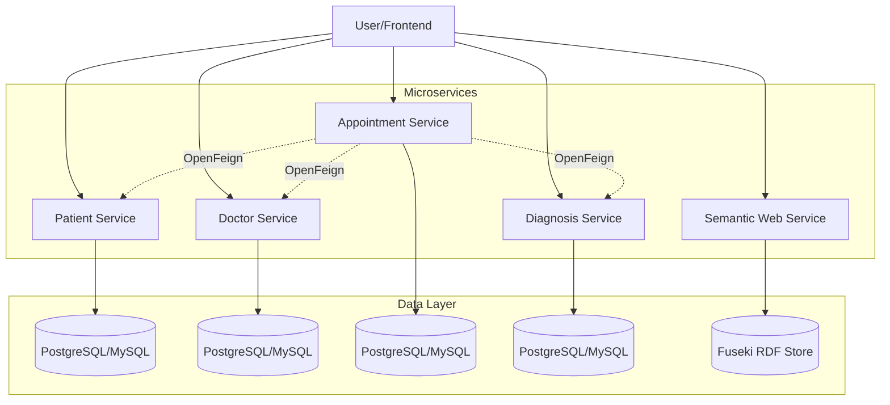

## Welcome to NOVA.ing Atención Médica

NOVA.ing Atención Médica is a comprehensive healthcare management platform built with a modern microservices architecture. The system integrates patient records, doctor schedules, appointments, diagnoses, and semantic web capabilities to provide intelligent medical data querying.

<CardGroup cols={2}>
  <Card title="Quick Start" icon="rocket" href="/quickstart">
    Get started with NOVA.ing in under 5 minutes
  </Card>
  <Card title="Architecture" icon="sitemap" href="/architecture">
    Understand the microservices architecture
  </Card>
  <Card title="API Reference" icon="code" href="/api/paciente/overview">
    Explore the REST APIs
  </Card>
  <Card title="Semantic Web" icon="brain" href="/concepts/semantic-web">
    Learn about RDF, OWL, and SPARQL integration
  </Card>
</CardGroup>

## Key Features

<AccordionGroup>
  <Accordion title="Microservices Architecture" icon="cubes">
    Five independent services with their own databases:
    - **Patient Service** - Manage patient records and medical history
    - **Doctor Service** - Handle doctor profiles and specialties
    - **Appointment Service** - Core scheduling and coordination
    - **Diagnosis Service** - Store and retrieve medical diagnoses
    - **Semantic Web Service** - RDF/OWL ontologies and SPARQL queries
  </Accordion>

  <Accordion title="Bidirectional Communication" icon="arrows-left-right">
    Services communicate using OpenFeign clients for seamless data enrichment:
    - Appointments pull patient and doctor details
    - Patients retrieve their appointment history
    - Diagnoses link to both appointments and patients
  </Accordion>

  <Accordion title="Semantic Web Layer" icon="brain">
    Advanced semantic capabilities powered by Apache Jena and OWL API:
    - Natural language search across medical records
    - RDF graph representation of healthcare data
    - SPARQL query execution for complex data analysis
    - Automatic synchronization from microservices to knowledge graph
  </Accordion>

  <Accordion title="React Frontend" icon="react">
    Modern web interface built with React and TypeScript:
    - Patient and doctor management dashboards
    - Appointment scheduling interface
    - Real-time semantic search chat
    - Responsive design with Tailwind CSS
  </Accordion>
</AccordionGroup>

## Technology Stack

The system is built with enterprise-grade technologies:

<Tabs>
  <Tab title="Backend">
    - **Java 25** - Latest Java LTS release
    - **Spring Boot 3.5.9** - Modern Spring framework
    - **Spring Cloud 2025.0.1** - Microservices infrastructure
    - **OpenFeign** - Declarative HTTP clients
    - **JPA/Hibernate** - Object-relational mapping
  </Tab>
  <Tab title="Databases">
    - **PostgreSQL** - Primary relational database
    - **MySQL** - Alternative database support
    - **Apache Jena Fuseki** - RDF triple store
  </Tab>
  <Tab title="Semantic Web">
    - **Apache Jena** - RDF processing and SPARQL
    - **OWL API** - Ontology management
    - **Fuseki Server** - SPARQL endpoint
  </Tab>
  <Tab title="Frontend">
    - **React 18** - UI framework
    - **TypeScript** - Type-safe JavaScript
    - **Vite** - Fast build tool
    - **Axios** - HTTP client
    - **Zustand** - State management
    - **Tailwind CSS** - Utility-first CSS
  </Tab>
</Tabs>

## Use Cases

NOVA.ing Atención Médica is designed for healthcare facilities that need:

<CardGroup cols={2}>
  <Card title="Appointment Management" icon="calendar-check">
    Schedule and track medical appointments with automatic conflict detection
  </Card>
  <Card title="Patient Records" icon="user-doctor">
    Maintain comprehensive patient medical histories and diagnoses
  </Card>
  <Card title="Semantic Search" icon="magnifying-glass">
    Query medical data using natural language instead of complex SQL
  </Card>
  <Card title="Data Integration" icon="share-nodes">
    Integrate with existing healthcare systems via REST APIs
  </Card>
</CardGroup>

## System Overview

## Next Steps

<Steps>
  <Step title="Quickstart Guide">
    Follow the [quickstart guide](/quickstart) to set up and run the system locally
  </Step>
  <Step title="Learn Core Concepts">
    Understand [microservices communication](/concepts/communication) and [semantic web integration](/concepts/semantic-web)
  </Step>
  <Step title="Deploy to Production">
    Configure [databases](/deployment/database) and [deploy services](/deployment/setup)
  </Step>
  <Step title="Integrate via APIs">
    Explore the [API reference](/api/paciente/overview) to integrate with your applications
  </Step>
</Steps>
